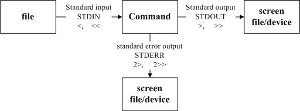

## shell编程
#### 1 认识BASH
###### 1.1 硬件、核心、shell关系、
>硬体：当然就是需要你的硬体有『音效卡晶片』这个配备，否则怎么会有声音；
    核心管理：作业系统的核心可以支援这个晶片组，当然还需要提供晶片的驱动程式啰；
    应用程式：需要使用者(就是你) 输入发生声音的指令啰！

>###### 定义：

>###### 为什么要学习shell
>linux常常需要远程链接、而链接过程中文字的传输效率一定比界面传输效率要高而且要快，不容易出现断线等情况。
 shell效率比较高，如果想要查询10台服务器的登陆情况，shell方式明显效率要高很多。
 >###### Bash shell的功能
    命令修复功能
    命令补全功能
    命令别名设定功能
    工作控制、前景背景控制（用户设置、控制与下达指令、自行运行工作）
    shell script
    万用字元
 >###### 查询指令是否为Bash shell内建命令type
    type [-tpa] name
    选项与参数：
        : 不太你家任何选项与参数时，type会显示name时外部指令还是bash内建指令
        -t:当加入-t会将name以地下字眼显示出他的意义：
            file:表示为外部指令
            alias:表示为命令别名所设定的名称
            builtin:表示该指令为bash内建的指令
        -p:如果后面的name为外部指令时才能显示完整的档名
        -a:会由PATH变数定义的路径中，将所有含name的指令都列出来，包含alias
>###### 指令的下达与快速编辑按钮
    指令换行：
    cp /var/spool/maill/root /etc/crontab\
    >/etc/fstab/root
    快捷键
    ctrl+u/ctrl+k 向前删除/向后删除
    ctrl+a/ctrl+e 指令最前/指令最后 
#### 2 shell变量
    echo $HOME | echo ${HOME}
    unset myname 取消变量
    环境变量的功能env export 
    用env观察环境变量与常见环境变量
    HOME:使用者的家目录    
    SHELL：告诉我们目前shell那个
    HISTSSIZE：历史指令
    MAILL：读取邮件信箱档案
    PATH：搜索路径
    LANG：语言
    RANDOM：随机数
    用set观察所有变数
        BASH:bash的主程序放置路径
        BASH_VERSINFO bash版本
        
    变数键盘读取、阵列与宣告：read,array,declare
        read:要读取来自键盘输入的变数
            选项与参数：
                -p:后面可以接提示字符
                -t:后面可以接等待秒数
         declare [-aixr] variable
            选项与参数：
            -a:将后面为variable的变数定义为array类型
            -i:整型
            -x:用法与export 将后面的variable编程环境变量
            -r:将变数设定成为readonly类型
    与档案系统及程序的限制关系：ulimit
    限制开启档案的数量
    ulimit [-SHacdfltu] 配合
    选项与参数：
        -H: 不能超过
        -s: 超过警告
        -a: 不跟其他选项参数，列出所有的限制额度
    变数内容的删除、取代与替换
    
    
    
#### 3 命令别名与历史命名
###### 命令别名设定：alias,unalias
###### 历史命令
    history
        选项与参数：
            n ：数字，意思是『要列出最近的n 笔命令列表』的意思！
            -c ：将目前的shell 中的所有history 内容全部消除
            -a ：将目前新增的history 指令新增入histfiles 中，若没有加histfiles ，
                  则预设写入~/.bash_history
            -r ：将histfiles 的内容读到目前这个shell 的history 记忆中；
            -w ：将目前的history 记忆内容写入histfiles 中！ 
#### 4 bash shell操作环境
###### 路径与指令搜寻顺序
###### bash进站与欢迎讯息
    cat /etc/issue
###### bash的环境设定档
###### 万用字元与特殊符号

#### 5 资料流重导向
###### 什么是资料流重导向
    资料流重导向(redirect) 由字面上的意思来看，好像就是将『资料给他传导到其他地方去』
    将命令执行后的数据输出到指定地方

    
###### 1、普通输出->输出到屏幕
    cat/etc/crontab
    cat/etc/vbirdsay(系统没有该文件vbirdsay,输出的是错误信息)
###### 2、linux下的标准输入输出
    linux下，每执行一条命令都有正确和错误的返回值，使用标准输入输出，将这些正确值和错误值分别输出到指定的位置
    1)标准输入：代码为0，使用< 或者<<
    2)标准输出：代码为1，使用1>或者1>>
    3)标准错误输出：代码为2，使用2> 或者2>>
    >:将原来的文件内容清空，重新写入
    >>:在原来我呢加内容末尾追加写入内容
    举例：
        cat hello1.sh 2> ./test1 将错误输出到test1文件中
        ls -l >./log 将目录下的文件信息输出到 log文件中
        cat /etc/vbirday 2>./log1 1>.log  将错误输出到log1，将正确输出到log文件
 ###### 3、-2>>/dev/null错误的数据放到回收站 
    /dex/null–类似的垃圾箱(回收站)
    举例：
        cat /etc/vbirday 2>>/dev/null  1>>./log
    
#### 6 管线命令
    